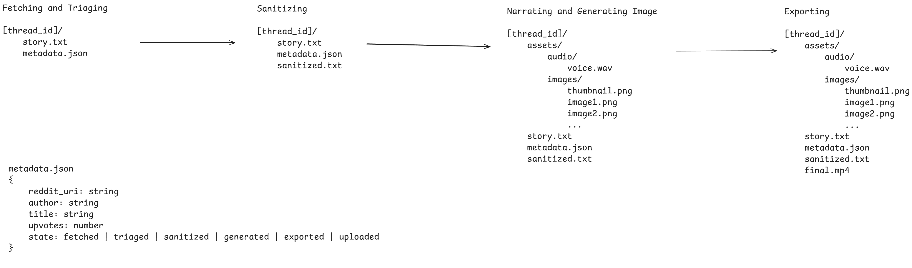

## Setup

### creepypasta yap 2.0

Notes:

- use protocols for class (composition)
- util functions
- use typer for shell
- poetry scripts
- cuda pkg for torch...
- make the image generation prompts within imagegen
- scraper and triage (fetching pipeline)
- config file kinda useless
- 
- this is the general flow:

